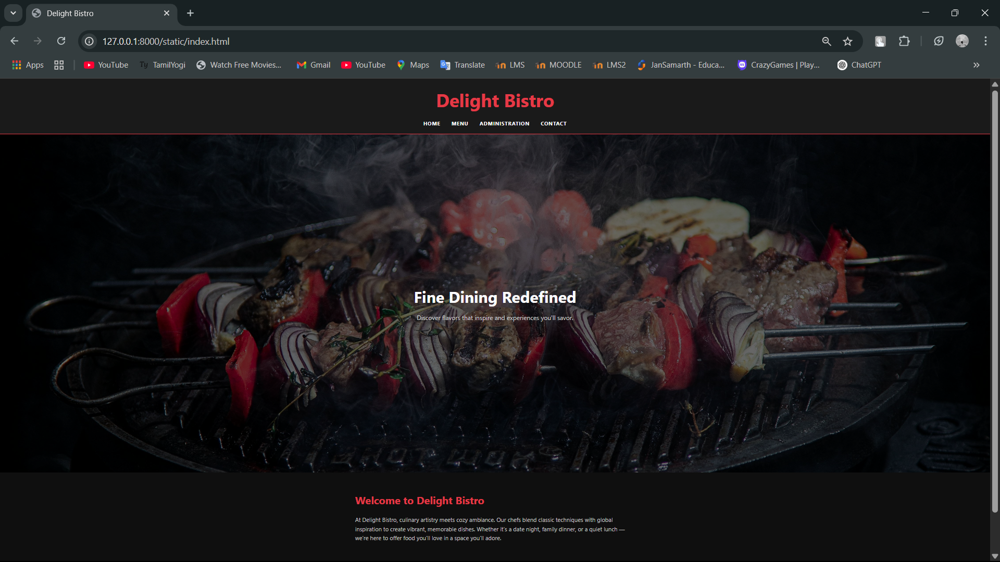
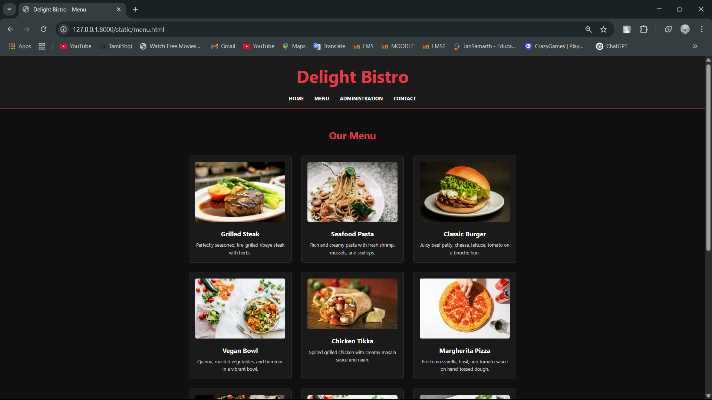
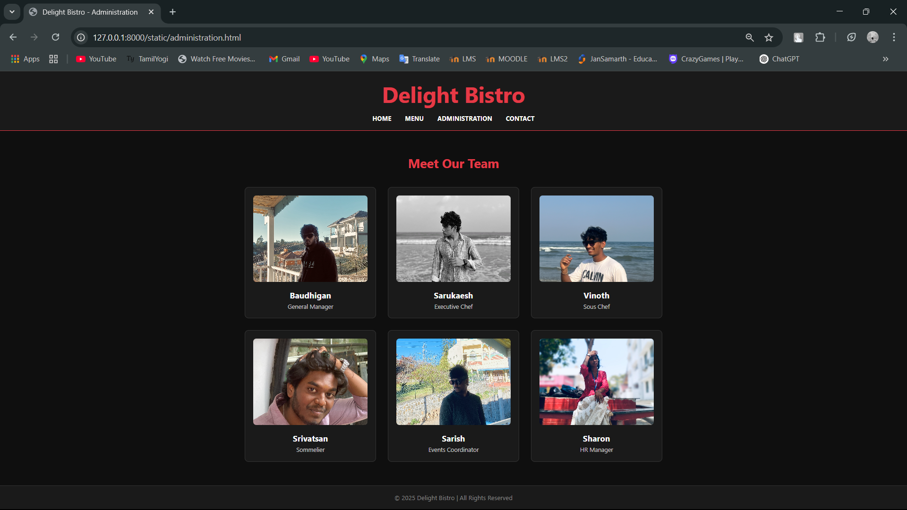
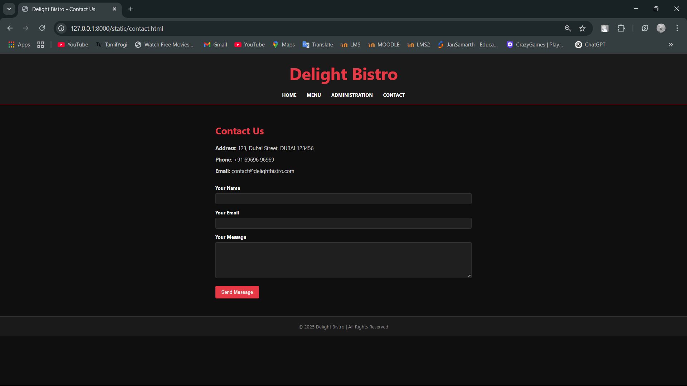

# Ex.07 Restaurant Website
# Date: 13.05.2025
# AIM:
To develop a static Restaurant website to display the food items and services provided by them.

# DESIGN STEPS:
## Step 1:
Requirement collection.

## Step 2:
Creating the layout using HTML and CSS.

## Step 3:
Updating the sample content.

## Step 4:
Choose the appropriate style and color scheme.

## Step 5:
Validate the layout in various browsers.

## Step 6:
Validate the HTML code.

## Step 7:
Publish the website in the given URL.

# PROGRAM:
### index.html
```
<!DOCTYPE html>
<html lang="en">
<head>
  <meta charset="UTF-8">
  <title>Delight Bistro</title>
  <meta name="viewport" content="width=device-width, initial-scale=1.0">
  <style>
    * {
      margin: 0;
      padding: 0;
      box-sizing: border-box;
    }

    body {
      font-family: 'Segoe UI', Tahoma, Geneva, Verdana, sans-serif;
      background-color: #0f0f0f;
      color: #eaeaea;
      line-height: 1.6;
    }

    header {
      background-color: #1a1a1a;
      padding: 20px 40px;
      border-bottom: 2px solid #e63946;
      text-align: center;
    }

    header h1 {
      color: #e63946;
      font-size: 3.5rem;
    }

    nav {
      margin-top: 15px;
    }

    nav a {
      color: #ffffff;
      text-decoration: none;
      margin: 0 15px;
      font-weight: bold;
      text-transform: uppercase;
      letter-spacing: 1px;
      transition: color 0.3s;
    }

    nav a:hover {
      color: #e63946;
    }

    .hero {
      position: relative;
      background: url("5.jpg") center/cover no-repeat;
      height: 70vh;
      display: flex;
      align-items: center;
      justify-content: center;
      text-align: center;
    }

    .hero::after {
      content: "";
      position: absolute;
      top: 0; left: 0;
      width: 100%;
      height: 100%;
      background-color: rgba(0, 0, 0, 0.6);
    }

    .hero-content {
      position: relative;
      z-index: 1;
      color: white;
    }

    .hero-content h2 {
      font-size: 3rem;
      margin-bottom: 10px;
    }

    .hero-content p {
      font-size: 1.2rem;
      color: #cccccc;
    }

    section {
      padding: 60px 20px;
      max-width: 900px;
      margin: auto;
    }

    .content h3 {
      color: #e63946;
      font-size: 2rem;
      margin-bottom: 20px;
    }

    .content p {
      font-size: 1.1rem;
      color: #c0c0c0;
    }

    footer {
      background-color: #1a1a1a;
      text-align: center;
      padding: 20px;
      color: #888888;
      border-top: 1px solid #333;
      margin-top: 60px;
    }

    @media (max-width: 768px) {
      .hero-content h2 {
        font-size: 2rem;
      }

      nav a {
        display: inline-block;
        margin: 10px 8px;
      }
    }
  </style>
</head>
<body>

  <header>
    <h1>Delight Bistro</h1>
    <nav>
      <a href="#">Home</a>
      <a href="menu.html">Menu</a>
      <a href="administration.html">Administration</a>
      <a href="contact.html">Contact</a>
    </nav>
  </header>

  <div class="hero">
    <div class="hero-content">
      <h2>Fine Dining Redefined</h2>
      <p>Discover flavors that inspire and experiences you'll savor.</p>
    </div>
  </div>

  <section class="content">
    <h3>Welcome to Delight Bistro</h3>
    <p>
      At Delight Bistro, culinary artistry meets cozy ambiance. Our chefs blend classic techniques with global inspiration to create vibrant, memorable dishes. Whether it’s a date night, family dinner, or a quiet lunch — we’re here to offer food you’ll love in a space you’ll adore.
    </p>
  </section>

  <footer>
    © 2025 Delight Bistro | All Rights Reserved
  </footer>

</body>
</html>

```

### menu.html
```
<!DOCTYPE html>
<html lang="en">
<head>
  <meta charset="UTF-8">
  <title>Delight Bistro - Menu</title>
  <meta name="viewport" content="width=device-width, initial-scale=1.0">
  <style>
    * {
      margin: 0;
      padding: 0;
      box-sizing: border-box;
    }

    body {
      font-family: 'Segoe UI', Tahoma, Geneva, Verdana, sans-serif;
      background-color: #0f0f0f;
      color: #eaeaea;
      line-height: 1.6;
    }

    header {
      background-color: #1a1a1a;
      padding: 20px 40px;
      text-align: center;
      border-bottom: 2px solid #e63946;
    }

    header h1 {
      color: #e63946;
      font-size: 3.5rem;
    }

    nav {
      margin-top: 15px;
    }

    nav a {
      color: #ffffff;
      text-decoration: none;
      margin: 0 15px;
      font-weight: bold;
      text-transform: uppercase;
      transition: color 0.3s;
    }

    nav a:hover {
      color: #e63946;
    }

    section {
      max-width: 1100px;
      margin: 60px auto;
      padding: 0 20px;
    }

    h2 {
      font-size: 2rem;
      color: #e63946;
      text-align: center;
      margin-bottom: 40px;
    }

    .menu-grid {
      display: grid;
      grid-template-columns: repeat(auto-fit, minmax(250px, 1fr));
      gap: 30px;
    }

    .menu-item {
      background-color: #1a1a1a;
      border: 1px solid #333;
      border-radius: 8px;
      padding: 20px;
      text-align: center;
      transition: transform 0.2s;
    }

    .menu-item:hover {
      transform: scale(1.03);
      border-color: #e63946;
    }

    .menu-item img {
      max-width: 100%;
      border-radius: 6px;
      margin-bottom: 15px;
    }

    .menu-item h3 {
      color: #ffffff;
      font-size: 1.3rem;
      margin-bottom: 8px;
    }

    .menu-item p {
      color: #cccccc;
      font-size: 0.95rem;
    }

    footer {
      background-color: #1a1a1a;
      text-align: center;
      padding: 20px;
      color: #888888;
      margin-top: 60px;
      border-top: 1px solid #333;
    }
  </style>
</head>
<body>

  <header>
    <h1>Delight Bistro</h1>
    <nav>
      <a href="index.html">Home</a>
      <a href="#">Menu</a>
      <a href="administration.html">Administration</a>
      <a href="contact.html">Contact</a>
    </nav>
  </header>

  <section>
    <h2>Our Menu</h2>
    <div class="menu-grid">

      <!-- Menu Items -->
      <div class="menu-item">
        
        <h3>Grilled Steak</h3>
        <p>Perfectly seasoned, fire-grilled ribeye steak with herbs.</p>
      </div>

      <div class="menu-item">
        
        <h3>Seafood Pasta</h3>
        <p>Rich and creamy pasta with fresh shrimp, mussels, and scallops.</p>
      </div>

      <div class="menu-item">
        
        <h3>Classic Burger</h3>
        <p>Juicy beef patty, cheese, lettuce, tomato on a brioche bun.</p>
      </div>

      <div class="menu-item">
        
        <h3>Vegan Bowl</h3>
        <p>Quinoa, roasted vegetables, and hummus in a vibrant bowl.</p>
      </div>

      <div class="menu-item">
        
        <h3>Chicken Tikka</h3>
        <p>Spiced grilled chicken with creamy masala sauce and naan.</p>
      </div>

      <div class="menu-item">
        
        <h3>Margherita Pizza</h3>
        <p>Fresh mozzarella, basil, and tomato sauce on hand-tossed dough.</p>
      </div>

      <div class="menu-item">
        
        <h3>Beef Tacos</h3>
        <p>Crispy corn shells filled with spiced beef, salsa, and cheese.</p>
      </div>

      <div class="menu-item">
        
        <h3>Caesar Salad</h3>
        <p>Crisp romaine, creamy dressing, parmesan, and croutons.</p>
      </div>

      <div class="menu-item">
        
        <h3>Sushi Platter</h3>
        <p>Assorted sushi rolls made fresh with premium ingredients.</p>
      </div>

      <div class="menu-item">
        
        <h3>Thai Curry</h3>
        <p>Spicy coconut curry with chicken and vegetables over jasmine rice.</p>
      </div>

      <div class="menu-item">
        
        <h3>Cheesecake</h3>
        <p>Creamy New York-style cheesecake with a buttery crust.</p>
      </div>

      <div class="menu-item">
        
        <h3>Chocolate Mousse</h3>
        <p>Silky-smooth dark chocolate mousse topped with whipped cream.</p>
      </div>

    </div>
  </section>

  <footer>
    © 2025 Delight Bistro | All Rights Reserved
  </footer>

</body>
</html>

```

### administration.html
```
<!DOCTYPE html>
<html lang="en">
<head>
  <meta charset="UTF-8">
  <title>Delight Bistro - Administration</title>
  <meta name="viewport" content="width=device-width, initial-scale=1.0">
  <style>
    * {
      box-sizing: border-box;
      margin: 0;
      padding: 0;
    }

    body {
      font-family: 'Segoe UI', Tahoma, Geneva, Verdana, sans-serif;
      background-color: #0f0f0f;
      color: #eaeaea;
    }

    header {
      background-color: #1a1a1a;
      padding: 20px 40px;
      text-align: center;
      border-bottom: 2px solid #e63946;
    }

    header h1 {
      color: #e63946;
      font-size: 3.5rem;
    }

    nav {
      margin-top: 15px;
    }

    nav a {
      color: #ffffff;
      text-decoration: none;
      margin: 0 15px;
      font-weight: bold;
      text-transform: uppercase;
      transition: color 0.3s;
    }

    nav a:hover {
      color: #e63946;
    }

    section {
      max-width: 1100px;
      margin: 60px auto;
      padding: 0 20px;
    }

    h2 {
      font-size: 2rem;
      color: #e63946;
      text-align: center;
      margin-bottom: 40px;
    }

    .team-grid {
      display: grid;
      grid-template-columns: repeat(auto-fit, minmax(250px, 1fr));
      gap: 30px;
    }

    .team-member {
      background-color: #1a1a1a;
      border: 1px solid #333;
      border-radius: 10px;
      text-align: center;
      padding: 20px;
      transition: transform 0.2s ease;
    }

    .team-member:hover {
      transform: translateY(-5px);
      border-color: #e63946;
    }

    .team-member img {
      width: 100%;
      height: 220px;
      object-fit: cover;
      border-radius: 8px;
      margin-bottom: 15px;
    }

    .team-member h3 {
      color: #ffffff;
      font-size: 1.3rem;
    }

    .team-member p {
      color: #cccccc;
      font-size: 0.95rem;
      margin-top: 5px;
    }

    footer {
      background-color: #1a1a1a;
      text-align: center;
      padding: 20px;
      color: #888888;
      margin-top: 60px;
      border-top: 1px solid #333;
    }
  </style>
</head>
<body>

  <header>
    <h1>Delight Bistro</h1>
    <nav>
      <a href="index.html">Home</a>
      <a href="menu.html">Menu</a>
      <a href="#">Administration</a>
      <a href="contact.html">Contact</a>
    </nav>
  </header>

  <section>
    <h2>Meet Our Team</h2>
    <div class="team-grid">

      <div class="team-member">
        
        <h3>Baudhigan</h3>
        <p>General Manager</p>
      </div>

      <div class="team-member">
        
        <h3>Sarukaesh</h3>
        <p>Executive Chef</p>
      </div>

      <div class="team-member">
        
        <h3>Vinoth</h3>
        <p>Sous Chef</p>
      </div>

      <div class="team-member">
        
        <h3>Srivatsan</h3>
        <p>Sommelier</p>
      </div>

      <div class="team-member">
        
        <h3>Sarish</h3>
        <p>Events Coordinator</p>
      </div>

      <div class="team-member">
        
        <h3>Sharon</h3>
        <p>HR Manager</p>
      </div>

    </div>
  </section>

  <footer>
    © 2025 Delight Bistro | All Rights Reserved
  </footer>

</body>
</html>

```

### contact.html
```
<!DOCTYPE html>
<html lang="en">
<head>
  <meta charset="UTF-8">
  <title>Delight Bistro - Contact Us</title>
  <meta name="viewport" content="width=device-width, initial-scale=1.0">
  <style>
    * {
      margin: 0;
      padding: 0;
      box-sizing: border-box;
    }

    body {
      font-family: 'Segoe UI', Tahoma, Geneva, Verdana, sans-serif;
      background-color: #0f0f0f;
      color: #eaeaea;
      line-height: 1.6;
    }

    header {
      background-color: #1a1a1a;
      padding: 20px 40px;
      text-align: center;
      border-bottom: 2px solid #e63946;
    }

    header h1 {
      color: #e63946;
      font-size: 3.5rem;
    }

    nav {
      margin-top: 15px;
    }

    nav a {
      color: #ffffff;
      text-decoration: none;
      margin: 0 15px;
      font-weight: bold;
      text-transform: uppercase;
      transition: color 0.3s;
    }

    nav a:hover {
      color: #e63946;
    }

    section {
      max-width: 900px;
      margin: 60px auto;
      padding: 0 20px;
    }

    h2 {
      font-size: 2rem;
      color: #e63946;
      margin-bottom: 20px;
    }

    .contact-info p {
      margin-bottom: 10px;
      font-size: 1.1rem;
      color: #cccccc;
    }

    form {
      margin-top: 30px;
    }

    label {
      display: block;
      margin: 15px 0 5px;
      font-weight: bold;
      color: #f0f0f0;
    }

    input, textarea {
      width: 100%;
      padding: 10px;
      background-color: #1f1f1f;
      border: 1px solid #333;
      color: #fff;
      border-radius: 4px;
    }

    textarea {
      resize: vertical;
      height: 120px;
    }

    button {
      margin-top: 20px;
      background-color: #e63946;
      color: white;
      padding: 12px 20px;
      border: none;
      border-radius: 4px;
      cursor: pointer;
      font-size: 1rem;
    }

    button:hover {
      background-color: #c5303d;
    }

    footer {
      background-color: #1a1a1a;
      text-align: center;
      padding: 20px;
      color: #888888;
      margin-top: 60px;
      border-top: 1px solid #333;
    }

    @media (max-width: 600px) {
      header h1 {
        font-size: 2rem;
      }
    }
  </style>
</head>
<body>

  <header>
    <h1>Delight Bistro</h1>
    <nav>
      <a href="index.html">Home</a>
      <a href="menu.html">Menu</a>
      <a href="administration.html">Administration</a>
      <a href="#">Contact</a>
    </nav>
  </header>

  <section>
    <h2>Contact Us</h2>

    <div class="contact-info">
      <p><strong>Address:</strong> 123, Dubai Street, DUBAI 123456</p>
      <p><strong>Phone:</strong> +91 69696 96969</p>
      <p><strong>Email:</strong> contact@delightbistro.com</p>
    </div>

    <form>
      <label for="name">Your Name</label>
      <input type="text" id="name" name="name" required>

      <label for="email">Your Email</label>
      <input type="email" id="email" name="email" required>

      <label for="message">Your Message</label>
      <textarea id="message" name="message" required></textarea>

      <button type="submit">Send Message</button>
    </form>
  </section>

  <footer>
    © 2025 Delight Bistro | All Rights Reserved
  </footer>

</body>
</html>

```
# OUTPUT:




# RESULT:
The program for designing software company website using HTML and CSS is completed successfully.
